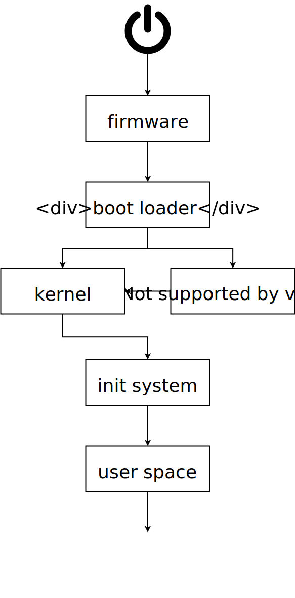

= Linux boot process 
Gabriel Arazas <foo.dogsquared@gmail.com>
2019-10-17 

Learning the low-level boot process of Linux (and computers, overall) can be helpful in knowing the grand picture of computer systems. 

This note is a less detailed lecture on the computer boot process specifically on Linux-based systems. 
It also focuses on the general concepts regarding on the booting process. 

== Firmware  

The process starts with the hardware. 
When the computer is first powered on, it will first boot up the **firmware** — a type of low-level program that manages the hardware. 

There are different firmware for computers but the most common firmwares used out in the wild are **Basic Input/Output System (BIOS)** and **UEFI-based firmwares**. 
Although newer firmwares has been developed, you may see the term BIOS is still referred to the firmware to be first booted in the computer. 

Firmwares are often found embedded in the motherboard with their own storage device. 
Thus, it is independent of the operating system to be used. 

The firmware can be configured and has its values stored on a separate https://en.wikipedia.org/wiki/Non-volatile_memory[nonvolatile memory] component also embedded on the motherboard. 

The most important function of firmware is initializing the hardware and performing a check on them. 
This process is referred to as the **power-on self-test** or POST. 

POST only checks the important and basic hardware for a working system such as the CPU and the memory. 

When the POST passes, the firmware will then look for a boot loader from a list of storage devices. 

== Boot loader 

The boot loader is a program that invokes the operating system kernel with the right kernel parameters. 

It is located on a storage device (also known as drive) such as the https://en.wikipedia.org/wiki/Hard_disk_drive[hard disk drive], https://en.wikipedia.org/wiki/Solid-state_drive[solid-state drive], https://en.wikipedia.org/wiki/Flash_drive[flash drive], and CD drive. 
Specifically, it lives on the https://en.wikipedia.org/wiki/Boot_sector[boot sector] of the storage device. 
Ergo, each storage device has its own boot loader. 

The boot loader generally loads the kernel image. 
Beforehand, it may also present you the option of choosing which operating system to be booted. 

It also has the additional task of creating an initial RAM-based filesystem (or initramfs) for critical files and executables. 
One of the most notable programs an initial RAM disk carries is a device manager — commonly uses udev — which is responsible for locating and managing hardware devices in the system. 

NOTE: The initial RAM disk can also be used for diskless booting of Linux. 
This is mostly done on embedded systems where disk storage space are cut short and may need to boot an operating system before performing its duties. 

== The kernel 

The boot loader now loads the kernel into the RAM. 
In most Linux-based setups, the kernel is compressed so the first task of the kernel is to decompress itself. 

The kernel then configures the hardware and loads the drivers. 
After that, it extracts the files from the initial RAM disk to set up for the booting the init process and mounting the filesystem.  

Once the hardware has been set up and the root filesystem has been mounted, the kernel will run **init** usually at `/sbin/init`. 
As indicated by its name, init is the first process to run. 
It is the ancestor of all the running processes on a Linux-based system. 

Not all init scripts have the same feature set. 
All of them have at least the guarantee of managing the system startup and shutdown, booting up daemons and the root filesystem. 

By this point, the initial RAM disk is dismounted. 

Then, init calls (typically six) startup virtual terminals with textual login prompt. 
Usually, these are assigned ttys with the names `tty1`–`tty6`. 
Commonly, these ttys are accessed with `Ctrl + Alt + F$` where `$` is simply the numerical part of the tty name. 

The login prompt where you enter your user credentials, if you have one. 
If you have a https://wiki.archlinux.org/index.php/Display_manager[display manager] installed and enabled, the prompt is replaced with the display manager implementation. 

NOTE: Most of the Linux-based major distributions adapted https://freedesktop.org/wiki/Software/systemd/[systemd] as the modern init implementation. 
The traditional init process (the System V variety) involves serial startup thus it can be slow waiting for one process to end. 
http://0pointer.de/blog/projects/systemd.html[systemd implements around the design limitations of the traditional init process]: parallelization and faster and smaller startup. 

== User space

Once the user successfully logins to their account, a user-level session will be made and various set ups are made. 
The user is now using the system in user mode. 

This is where environmental variables are set, various initial user programs are initialized, and the shell is run. 

From this point, it is entirely up to the user what programs to be run. 
Some setups automate a part of the program (either through the init script or their own) such as autostarting a display server (e.g., https://www.x.org/wiki/[Xorg], https://wayland.freedesktop.org/[Wayland]), https://en.wikipedia.org/wiki/Window_manager[window manager] (e.g., https://i3wm.org/[i3], https://awesomewm.org/[awesome]), or a complete https://en.wikipedia.org/wiki/Desktop_environment[desktop environment] (e.g., https://xfce.org/[Xfce], https://www.gnome.org/[GNOME]). 

== TL;DR 

I made a flowchart summarizing the Linux boot process. 
I just want to create a visual aid. 

== Appendix 

https://wiki.archlinux.org/index.php/Arch_boot_process[_Arch boot process_ from "Arch Wiki"]:: 
An https://wiki.archlinux.org/[Arch wiki] entry on the boot loading process though it specifically documents on the Arch Linux process. 
Nonetheless, it's a good entry article of the Linux boot process. 

https://courses.edx.org/courses/course-v1:LinuxFoundationX+LFS101x+3T2018/[_Introduction to Linux_ by "Linux Foundation"]:: 
A massive open online course (MOOC) offered by the https://www.linuxfoundation.org/[Linux Foundation]. 
It introduces you to the Linux ecosystem from its philosophy to its internals. 
Definitely a recommended resource for knowing Linux. 

https://en.wikipedia.org/wiki/Linux_startup_process[_Linux startup process_ from "Wikipedia"]:: 
A Wikipedia entry on the Linux startup process. 
Despite the bad rap that Wikipedia gets, it explains the process pretty good. 
